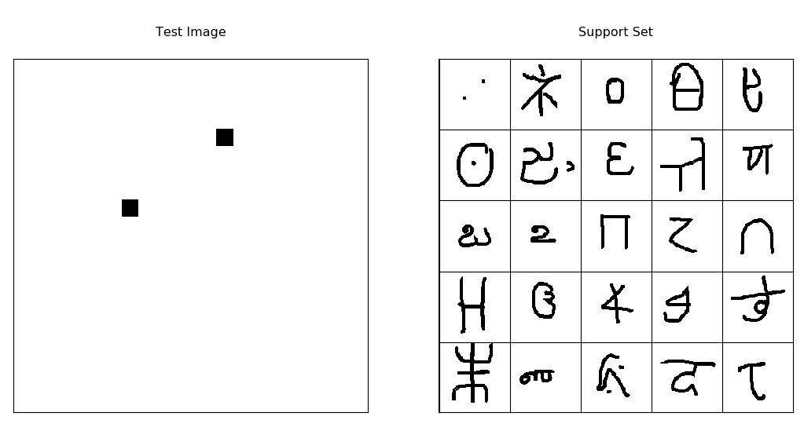

# keras-oneshot

[koch et al, Siamese Networks for one-shot learning,](https://www.cs.cmu.edu/~rsalakhu/papers/oneshot1.pdf)  (mostly) reimplimented in keras. 
Trains on the [Omniglot dataset]( https://github.com/brendenlake/omniglot).

Also check out my [blog post](https://sorenbouma.github.io/blog/oneshot) about this paper and one shot learning in general!


## Installation Instructions
To run, you'll first have to clone this repo and install the dependencies

```bash
git clone https://github.com/sorenbouma/keras-oneshot
cd keras-oneshot
sudo pip install -r requirements.txt

```

Then you'll need to download the omniglot dataset and preprocess/pickle it with the load_data.py script.
```bash
git clone https://github.com/brendenlake/omniglot
python load_data.py --path <PATH TO THIS FOLDER>/omniglot
```
Then you can run the jupyter notebook:
```bash
jupyter notebook
```

